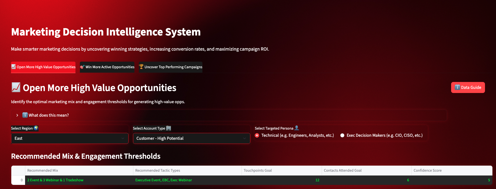

# 📊 Marketing Decision Intelligence System
Streamlit app for marketing campaign insights

Welcome to the Marketing Decision Intelligence System — an interactive, AI-powered Streamlit application designed to help marketing teams analyze, optimize, and recommend high-impact campaigns using historical performance and account-level engagement data.

## 🎥 Watch the 1-Minute Demo

Curious how the tool works? Check out this quick walkthrough:

👉 [Watch on Loom](https://www.loom.com/share/YOUR-VIDEO-LINK)

## 📸 App Preview

This app enables users to:

- Filter by Region and Account Type to view tailored insights

- Uncover the best tactics to open and close opportunities

- Evaluate campaign effectiveness using ROI-driven analytics

- Get AI-assisted recommendations based on tactic mix, persona match, and performance tiers

- ⚠️ All data within this project is synthetic and for demonstration purposes only.

  

## 🚀 Features
✅ **Tab 1: Open Opportunities**

- Discover the best marketing tactics and persona combinations to generate pipeline.

- Custom recommendations based on AI models for a chosen Region and Account Type.

✅ **Tab 2: Close Opportunities**

- Analyze post-opportunity and won-stage tactics that help accelerate deals.

- Persona + tactic alignment based on historical closes.

✅ **Tab 3: Campaign Effectiveness**

- Explore which campaigns drove the most ROI.

- View quadrant bubble charts by influence window (MGO, MIO, Won).

✅ **Call to Action (bottom of Tab 3): Final Recommendations**

- Automatically match your recommended tactic mix to top-performing campaigns.

- Curated campaign picks for opening and/or closing opps — tailored by region, account type, and tactic strategy.

## 💡 How It Works

1. **Synthetic Dataset**
The app reads from a structured Excel file with multiple tabs: segment recommendations, account-level targeting, campaign-level performance, etc.

2. **Streamlit UI**
A clean, responsive user interface built in Streamlit
 for exploration and decision support.

## 🧠 How the Recommendations Are Generated

The recommendations in **Tab 1** are powered by a machine learning model trained on historical engagement and pipeline data.

You can explore the full modeling pipeline and logic in this notebook:

👉 [View the predictive_recommendations_model.ipynb](./predictive_recommendations_model.ipynb)

## 🧠 Data & Logic Highlights

- **Tier Labels** (Invest, Refine, Reduce) determined by ROI score thresholds

- **Persona and Tactic Recommendations** vary by segment and funnel stage

- **Campaign Matching Logic** includes mix fit, tactic alignment, and regional performance

## 🚀 Try the App

No setup required — just click the link below to launch the tool in your browser:

- 👉 Launch the Marketing Decision Intelligence System

- ⚠️ You may need to create a free Streamlit Cloud account to access the full functionality.

💡 Optional: For Advanced Users

If you'd prefer to run the app locally on your own machine:

git clone https://github.com/JoshBeasley95/marketing-decision-intelligence-system
cd marketing-decision-intelligence-system
pip install -r requirements.txt
streamlit run streamlit_app_synthetic_data.py

## 📬 Contact

Built by Joshua Beasley
Questions? Feedback? Reach out at texasjmb@gmail.com
 or connect on LinkedIn
